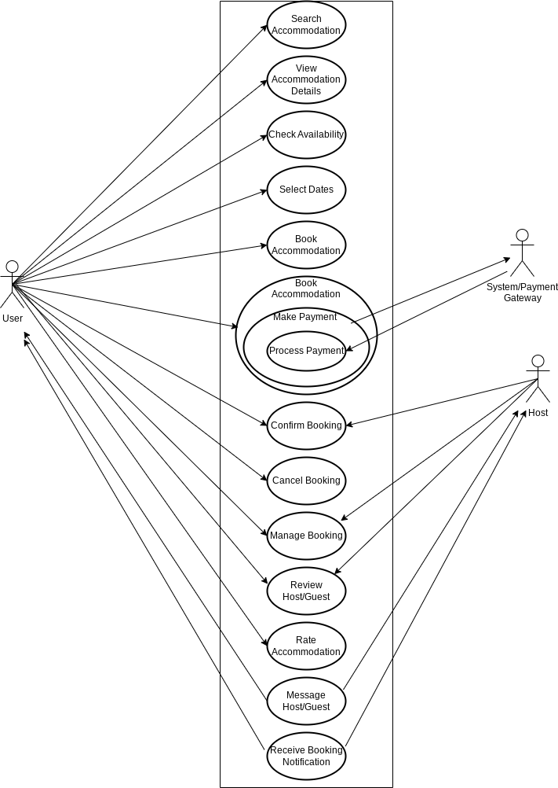

# Requirement Analysis in Software Development

Welcome to the requirement-analysis repository!  
This repository serves as the central hub for all artifacts related to the **Requirement Analysis** phase of our software development projects. Its primary purpose is to systematically identify, define, and document the needs and expectations of our stakeholders. By centralizing this crucial information, we aim to ensure a shared understanding of what the software should achieve, mitigate risks by resolving ambiguities early, and provide a clear foundation for effective design, development, and testing. Ultimately, this repository ensures that the software we build truly aligns with user needs and delivers maximum value.

# What is Requirement Analysis?

Requirement Analysis is a critical phase in the software development lifecycle (SDLC) where the project team gathers, analyzes, and defines the requirements of the software product to be developed. This process ensures that all stakeholders have a clear and mutual understanding of what the system should do and how it should perform.

# Why is Requirement Analysis Important?

- **Clarity and Understanding:** It helps in understanding what the stakeholders expect from the software, reducing ambiguity.
- **Scope Definition:** Clearly defines the scope of the project, which helps in preventing scope creep.
- **Basis for Design and Development:** Provides a solid foundation for designing and developing the system.
- **Cost and Time Estimation:** Facilitates accurate estimation of project cost, resources, and time.
- **Quality Assurance:** Ensures that the final product meets the specified requirements, leading to higher customer satisfaction.

# Key Activities in Requirement Analysis

## 1. Requirement Gathering
* **Interviews:** Conducting interviews with stakeholders to gather detailed information about their needs and expectations.
* **Surveys/Questionnaires:** Distributing surveys to collect requirements from a larger audience.
* **Workshops:** Organizing workshops with stakeholders to discuss and gather requirements.
* **Observation:** Observing end-users in their working environment to understand their needs.
* **Document Analysis:** Reviewing existing documentation and systems to understand current functionalities and requirements.

## 2. Requirement Elicitation
* **Brainstorming:** Conducting brainstorming sessions to generate ideas and gather requirements.
* **Focus Groups**: Holding focus group discussions with selected stakeholders to gather detailed requirements.
* **Prototyping:** Creating prototypes to help stakeholders visualize the system and refine their requirements.

## 3. Requirement Documentation 
* **Requirement Specification Document:** Creating a detailed document that lists all functional and non-functional requirements.
* **User Stories:** Writing user stories to describe functionalities from the user’s perspective.
* **Use Cases:** Creating use case diagrams to show interactions between users and the system.

## 4. Requirement Analysis and Modeling 
* **Requirement Prioritization:** Prioritizing requirements based on their importance and impact on the project.
* **Feasibility Analysis:** Assessing the feasibility of requirements in terms of technical, financial, and time constraints.
* **Modeling:** Creating models (e.g., data flow diagrams, entity-relationship diagrams) to visualize and analyze requirements.

## 5. Requirement Validation 
* **Review and Approval:** Reviewing the documented requirements with stakeholders to ensure accuracy and completeness.
* **Acceptance Criteria:** Defining clear acceptance criteria for each requirement to ensure they meet the expected standards.
* **Traceability:** Establishing traceability matrices to ensure all requirements are addressed during development and testing.

# Types of Requirements

## Functional Requirements

1. **Hotel Management Service:**
    - **_Hotel Registration and Management:_** Hotel managers/owners can onboard their properties, manage hotel information, and access a  
    dedicated portal for these tasks. This includes listing hotels on the platform and modifying room availability. 
    - **_Room Inventory Management:_** Hotels can update room types, availability, and rates for different dates.

2. **User Management Service:**
    - **_User Profile Management:_** Customers can create, update, and delete their profiles, including personal information and preferences.
    _ **_Authentication and Authorization:_** Secure user login and access control for both customers and hotel managers.

3. **Search Service:**
     - **_Hotel Search:_** Customers can search for hotels by name, city, or other criteria, with results displaying available rooms   
     and details like pricing and amenities. The search functionality is designed to handle large datasets efficiently.

4. **Booking Service:**
     - **_Hotel Reservation:_** Customers can book a hotel room, selecting specific dates and room types. The system ensures no double   
     booking occurs by locking a room during the booking process.
     - **_Reservation Tracking:_** Users can view all their past and current reservation.

5. **Payment Service:**
     - **_Payment Processing:_** Customers can make payments using various methods (e.g., credit card, digital wallet), with the system  
     generating detailed bills that include tax details.
     - **_Payment Confirmation:_** A booking is marked complete only after successful payment.     

6. **Notification Service:**
     - **_Real-Time Notifications:_** The system sends notifications to customers and hotel managers for events like booking confirmations,  
     cancellations, or new offers.

7. **Analytics Service:** 
     - **_Big Data Analysis:_** The system collects data for business analytics

## Non-functional Requirements

1. **Scalability:**
     - **_High Traffic Handling:_** The system must handle a high volume of user traffic, especially during peak seasons, by adopting a  
     microservices architecture. Each service (e.g., search, booking, payment) can be scaled independently to manage load.
     - **Database Scalability:_** The system uses a master-slave database architecture, where the master database handles write  
     operations and slave databases handle read operations to distribute load and improve performance.

2. **Performance:**
     - **_Low Latency for Search:_** The search functionality is optimized for speed, leveraging Content Delivery Networks (CDNs) to  
     deliver static content (e.g., images) quickly by caching data closer to users.
     - **_Efficient Data Processing:_** The use of messaging queues (e.g., Kafka, RabbitMQ) ensures efficient processing of  
     notifications and data updates without bottlenecks.
    
3. **Reliability:**
     - **_No Glitches:_** The system is designed to operate "without a single glitch," implying high reliability through robust  
     microservices and fault-tolerant database replication (master-slave architecture).
     - **_Data Consistency:_** The master-slave database setup ensures that data updates (e.g., room availability) are synced  
     from the master to slave databases, maintaining consistency for read-heavy operations.

4. **Availability:**
     - **_High Uptime:_** The system uses distributed architectures (e.g., CDNs, microservices, and database replication) to  
     ensure high availability, minimizing downtime even under heavy load.
     
5. **Maintainability:**
     - **_Modular Design:_** The microservices architecture divides the system into smaller, independent service 
     (e.g., hotel management, booking, payment), making it easier to maintain and update individual components without  
     affecting the entire system.

6. **Concurrency Control:** 
    - **_Prevent Double Booking:_** The booking service locks a room during the reservation process to prevent multiple 
    users from booking the same room simultaneously, ensuring data integrity.

# Use Case Diagrams
Use Case Diagrams are visual tools that illustrate how actors (e.g., users, external systems) interact with a system's   
functionalities (use cases), such as "Book Room" or "Search Hotels" in a hotel booking app. They show actors, use cases,  
and their relationships to define system scope and behavior. 

Their benefits include clarifying functional requirements, improving stakeholder communication, identifying actors and   
interactions, facilitating requirement validation, guiding system design and testing, managing scope, and promoting  
modularity. These diagrams ensure alignment between technical and non-technical teams, streamline development, and  
support testing for systems like hotel booking apps.

# Acceptance Criteria

## The Importance of Acceptance Criteria in Requirement Analysis

Acceptance Criteria are vital in Requirement Analysis because they define the "definition of done" for each requirement.  
They ensure clarity, enable effective testing, reduce rework, and align stakeholder expectations, ultimately leading to  
higher quality solutions.

## Example Acceptance Criteria for Checkout Feature

**Feature:_Checkout Process_**

- A user with **items** in their cart, when they click **Checkout**, then they are directed to the secure payment page.

- Valid payment details, when the user **confirms payment**, then the **booking is confirmed, and a confirmation email is sent.**

- Invalid payment details, when the user **confirms payment**, then an **error message is displayed, and the booking fails.**

